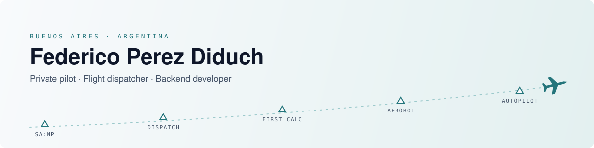
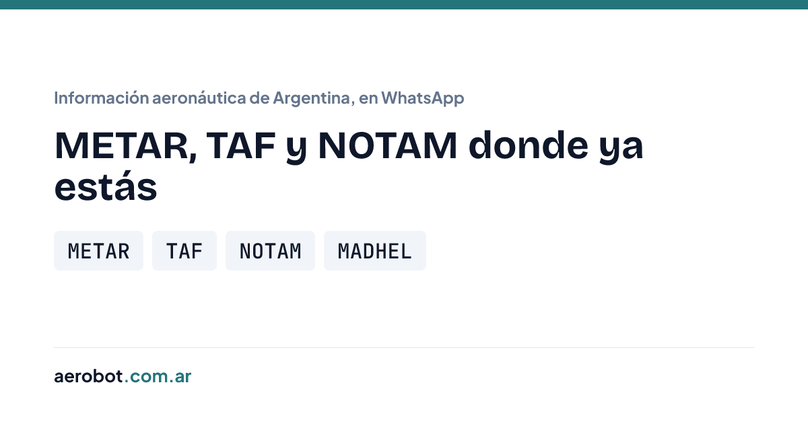
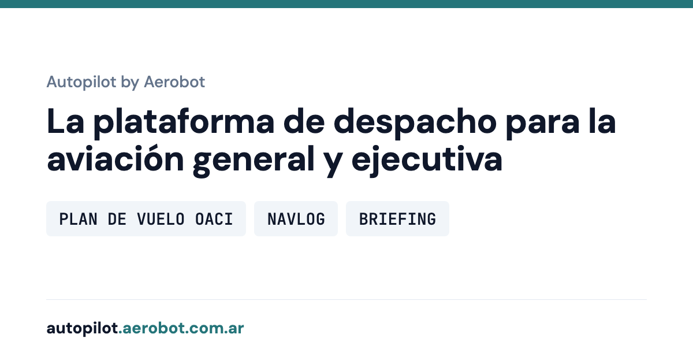

<picture>
  <source media="(prefers-color-scheme: dark)" srcset="assets/header-dark.svg" />
  
</picture>

  

  
  
  

I'm a private pilot and flight dispatcher who became a backend developer. Dispatch school was full of the same calculations over and over, weight and balance, runway numbers, so my first real program was a small calculator to do them for me. From there, no one could stop me.

## What I'm building

<table>
  <tr>
    <td width="50%" valign="top">
      
       <b><a href="https://aerobot.com.ar">Aerobot</a></b> 
      In the air you don't always have signal, and you can't open three or four websites to find one piece of information. With Aerobot, one WhatsApp message gets you what you need.
    </td>
    <td width="50%" valign="top">
      
       <b><a href="https://autopilot.aerobot.com.ar">Autopilot by Aerobot</a></b> 
      The dispatch platform for general and business aviation: ICAO flight plans, navlog and briefing in one place.
    </td>
  </tr>
</table>

## Open source

<table>
  <tr>
    <td width="50%" valign="top">
      
       <b><a href="https://github.com/aerodiduch/phone-joystick">phone-joystick</a></b> 
      Your phone as a gamepad for your laptop. I built it to play PES 6 at work.
    </td>
    <td width="50%" valign="top">
      
       <b><a href="https://github.com/aerodiduch/goflight-mcp-pro-msfs">goflight-mcp-pro-msfs</a></b> 
      A friend passed me his GoFlight MCP Pro. GoFlight is gone, and the only tool for MSFS 2024 left the PMDG 737's displays dark, so I wrote my own bridge.
    </td>
  </tr>
</table>

Also: [garmin-flights](https://github.com/aerodiduch/garmin-flights) pulls the flights out of a Garmin Aera 500 and shows them in Google Earth.

## Toolbox

<picture>
  <source media="(prefers-color-scheme: dark)" srcset="https://skillicons.dev/icons?i=python%2Cgo%2Cts%2Creact%2Cfastapi%2Cmongodb%2Credis%2Cdocker%2Clinux%2Cgit&theme=dark" />
  
</picture>

<b>✈️ How it started</b>

 

As much as it sounds like a joke, what sparked my love for programming was Grand Theft Auto: San Andreas. Its multiplayer, SA:MP, was huge back then, and the servers ran on a language called Pawn. At ten I liked to play around with those files, paste in pieces of code and see what they did.

Years later I was finishing my studies as a flight dispatcher, full of tasks that needed the same calculations over and over: weight and balance, runway calculations and so on. That's when I started programming seriously, and my first project was a small calculator for those problems. From there, no one could stop me.

I like being efficient and solving real-life problems. Every project has taught me something new, and I want to keep growing; it's what makes me happiest.

